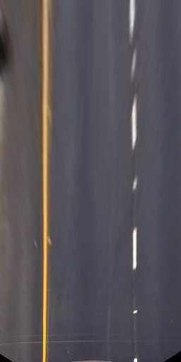
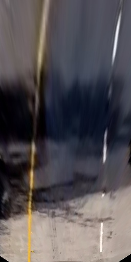

# Advanced Lane Finding Project

The goals / steps of this project are the following:

* Compute the camera calibration matrix and distortion coefficients given a set of chessboard images.
* Apply a distortion correction to raw images.
* Use color transforms, gradients, etc., to create a thresholded binary image.
* Apply a perspective transform to rectify binary image ("birds-eye view").
* Detect lane pixels and fit to find the lane boundary.
* Determine the curvature of the lane and vehicle position with respect to center.
* Warp the detected lane boundaries back onto the original image.
* Output visual display of the lane boundaries and numerical estimation of lane curvature and vehicle position.

## Camera Calibration

The code for this step can be found in `calibration.py`.
I used opencv's `cv2.findChessboardCorners` and `cv2.calibrateCamera` to extract the points and do the calibration.
To undistort the images after, I used `cv2.undistort`.

Results of this process for all calibration images can be found in `output_images`.
Here an example:


To avoid having to calibrate the camera every time, I saved the result to `calobration.pkl`.

## Pipeline (single images)

Here I will describe the individual steps of the pipeline briefly.
All the code for this is located in `pipeline.py`
Throughout this section I will use the following image to illustrate the individual steps:


More examples can be found in `output_images`.

### 1. Distortion-correction

After loading the calibration parameters, I just use `cv2.undistort` to get an undistorted image.
This is the result:


### 2. Perspective transform

After undistoring th image, I transform it to a top-down view.
Code for this step can be found is in the function `warp`.

I decided to use 256x512 as the target image size, as this is more similar to the actual road dimensions.
I used gimp to extract goo pixel coordinates for the source image and used 1/4 and 3/4 for the horizontal target points respectively.

The mapping I used:

| Source        | Destination   |
|:-------------:|:-------------:|
| 596, 450      | 64, 0         |
| 688, 450      | 192, 0        |
| 1048, 681     | 192, 512      |
| 276, 681      | 64, 512       |

This results in the followig output:

| Straight road                                         | Example image                              |
|:-----------------------------------------------------:|:------------------------------------------:|
|  |  |

### 3. Extracting binary image

To extract a binary image I use a combination of thresholds on color and the sobel operator.
I found that using the `R` channel exclusively is enough to get a decent result.
Code for this step can be found in lines 26-70 (`thresh_r`, `thresh_sobel`, `cleanup_thresholds`, `combine_thresholds`).

I first generate the individual thresholds.
To do this, I use `cv2.adaptiveThreshold`.
I found that this improved the output somewhat over the non-adaptive version.

For the sobel operator, I use a blurred image as input.
This makes it more predictable where exactly the lane boundaries are found and removes much of the noise.

I then remove all detected regions that are too wide to represent a lane line.
This is easily done by subtracting horizontally shifted versions of the found binary images.
Afterwards I am left with the following for the 3 channels:


As you can see, not all masks are always successful.
To finally find the real lane line pixels, I use a majority vore between the 3 masks.
I know that for a good lane detection the sobel masks are offset by a fixed amount from the actual lane line.
This means I can just translate them back onto the color threshold masks, add them all up and get the final result via majority vote:


### 4. Finding lane line pixels and fitting curve

To find the lane line pixels for the left and right lane, I first generate a histogram of all the the pixels in the lower quarter of the image.
Since the thresholging yields fairly sharp lane lines, I apply a gaussian blur beforehand.
With this, I can almost always find a unique starting point for the left and right lane.

After establishing the starting point, I use a windowed search from the bottom to the top to collect all the lane line pixels.
Finally I use `np.polyfit` to fit a polinomial with the following result:


### 5. Road curvature and vehicle position

With the lines fitted, I use the technique presented at http://www.intmath.com/applications-differentiation/8-radius-curvature.php and implemented in the course to get the lane line curvature.
To convert from pixel space to real-world space, I used the following mapping:

```
ym_per_pix = 3.0/54  # meters per pixel in y dimension
xm_per_pix = 3.7/128 # meters per pixel in x dimension
```

To calculate the distance from the lane center, I take the average distance from left and right track.

Code for this step is in `find_radii_and_cte`.

### 6. Plotting lane back on original image

After calculating the fitted lane lines, I use `warp` to project the result back on the original (undistorted) image.


## Pipeline (video)

I used the pipeline described above to find the lane in the project video: 
I also tried running it on the challenge video, but got very mixed results: 

## Discussion

The pipeline works fairly well on the project video, but breaks down quickly on slightly different input.
This is due to the hand-tuned thresholds used.
To improve on this, one could use different thresholds to generate the lane lines.
If the threshold is too high, the result just won't find anything.
If the threshold is too low, the output would be empty after the cleanup step as the found regions would be too wide.
In both these cases, the results could be discarded via some sort of voting mechanism.
The parameter of this vote could be chosen to generate sharp lane markings.

It also gets distracted easily, as can be seen in .
I tried to use a previous match to inform the next, but haven't had any success.
I was also surprised not to get any performance benefits by doing so.
To fix this issue, one would have to look at the individual images where it gets sumped, but I haven't done that yet.

Another issue is that the pipeline as is makes a lot of assumptions about how a lane line has to look.
In the `herder_challenge_video.mp4`, there is a double lane line.
Since I throw out wide segments, this would be a challenge, as it could decrease the quality of the other matches again.
